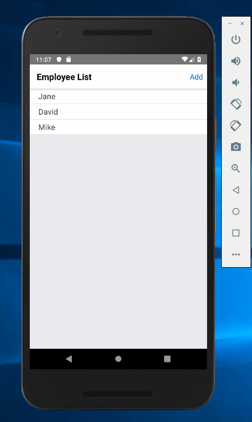

## Mobile Mananger Application

## Table of contents
1. [Description](#description)
2. [Technology](#technology)
3. [Installation](#installation)
4. [Usage](#usage)

## Description

This is a mobile application designed to simulate managerial functions, providing a comprehensive suite of features. It includes authentication, the ability to add and remove employees efficiently, and tools for creating and modifying schedules. Additionally, it allows managers to send text message updates to employees directly from within the application. 

## Technology

- [React](https://reactjs.org/)
- [React Native](https://facebook.github.io/react-native/)
- [Redux](https://nodejs.org/en/)
- [Node](https://redux.js.org/)
- [Firebase](https://firebase.google.com/?gclid=CjwKCAiAu_LgBRBdEiwAkovNsHlQPY70DcCREV4VL-Xfnr8vQUxI0JF5d5atsvVEJeYzVIkW43-iBBoCumMQAvD_BwE)

## Installation

The installation process for React Native applications is quite detailed and can be lengthy; a comprehensive guide on how to do so can be followed [here](https://codeburst.io/setting-up-development-environment-using-react-native-on-windows-dd240e69f776). 

## Usage

#### Login

#### Edit employee

#### Edit schedule
